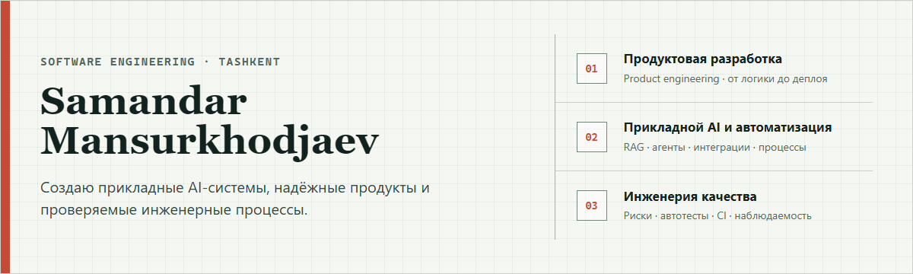

  

# Привет, я Самандар Мансурходжаев

**Product-minded Full-stack Developer · AI Automation Engineer · QA / Quality Engineer**

Я превращаю продуктовую идею в работающую систему: уточняю задачу, проектирую пользовательский сценарий и архитектуру, собираю frontend и backend, подключаю AI и интеграции, деплою, проверяю критичные риски и довожу результат до состояния, которое можно показать пользователю или бизнесу.

Мой основной профиль — **TypeScript/React/Next.js, Python/FastAPI, PostgreSQL/Supabase, AI/RAG и автоматизация**. Качество для меня не отдельный финальный этап: требования, тест-дизайн, API/UI/E2E-проверки, наблюдаемость и CI закладываются вместе с продуктом.

  <a href="https://klawis.uz">Klawis Live</a> ·
  <a href="https://softlylove.uz">Softly Live</a> ·
  <a href="https://dostupnoe-pravo-alpha.vercel.app">Legal CRM Demo</a> ·
  <a href="https://github.com/SamandarMansurkhodjaev2713/private-projects-showcase">Каталог проектов</a> ·
  <a href="https://github.com/SamandarMansurkhodjaev2713/qa-engineering-portfolio">QA-портфолио</a>

## Избранные проекты

| Проект | Что создано | Главный инженерный сигнал |
|---|---|---|
| **[Доступное Право](https://github.com/SamandarMansurkhodjaev2713/dostupnoe-pravo)** · [демо](https://dostupnoe-pravo-alpha.vercel.app) | CRM для частной юридической практики: клиенты, дела, статусы, история, заметки, следующий шаг, Telegram/email | Clean Architecture, Next.js 16, Supabase/PostgreSQL, RLS, конкурентные обновления, **192 теста**, CI |
| **[Klawis](https://klawis.uz)** | Legal AI-навигация с маршрутизацией запроса, retrieval, источниками и проверяемыми ответами | RAG, FastAPI, Next.js, Supabase, оценка качества AI-ответов, sensitive-domain UX |
| **[Softly / CoupleOS](https://softlylove.uz)** | Mobile-first продукт для пар с приватными сценариями, ритуалами, PWA и push-уведомлениями | Founder ownership, продуктовая стратегия, emotional UX, Supabase Auth/RLS, privacy-first подход |
| **[TTYL Platform](https://github.com/SamandarMansurkhodjaev2713/private-projects-showcase/blob/main/cards/ttyl-platform.md)** | Приватная on-prem платформа: проекты, чаты, файлы, поиск, аудит, роли и realtime | Enterprise system design, NestJS/Next.js, PostgreSQL, Redis, MinIO, RBAC, интеграционные и E2E-проверки |
| **[AI Classroom](https://github.com/SamandarMansurkhodjaev2713/private-projects-showcase/blob/main/cards/ai-classroom.md)** | Privacy-first система анализа учебной аудитории через доказательные события и human review | FastAPI, React, AI workers, очереди, локальное хранение, golden reports, воспроизводимость и широкий test suite |
| **[Platform Core](https://github.com/SamandarMansurkhodjaev2713/private-projects-showcase/blob/main/cards/platform-core.md)** | Общий AI-контур: gateway провайдеров, омниканальный хаб и регрессионный eval harness | Go + NestJS + Python, routing/fallback, cost accounting, human takeover, CI-gates для поведения AI |
| **[Sentinel Edge](https://github.com/SamandarMansurkhodjaev2713/sentinel-edge-smart-system)** · [демо](https://samandarmansurkhodjaev2713.github.io/sentinel-edge-smart-system/) | Локальная smart-система от firmware до операторского dashboard | Arduino C++, serial protocol, Node.js bridge, WebSocket, React/Vite, realtime telemetry |
| **[Task-manager](https://github.com/SamandarMansurkhodjaev2713/Task-manager)** | Telegram-автоматизация задач, ролей, дедлайнов, напоминаний и аудита | Rust, Teloxide, SQLx, async jobs, RBAC, Docker, regression tests и CI |

> Часть коммерческих и внутренних систем приватна. Для них опубликованы безопасные case studies: проблема, моя роль, стек, архитектура, решения, качество и доступные доказательства без клиентского кода, данных и секретов.

## Как я работаю с качеством

- начинаю с требований, рисков и критериев приёмки, а не с хаотичной проверки готового интерфейса;
- проверяю систему на нескольких уровнях: domain/unit, API и интеграции, данные/SQL, UI и критичные E2E-сценарии;
- автоматизирую стабильные и дорогие для ручного повтора проверки, а исследовательское тестирование оставляю человеку;
- использую Playwright, pytest, Vitest/Jest, xUnit, Postman/Newman, SQL и GitHub Actions там, где инструмент соответствует риску;
- фиксирую ограничения, точки отказа, диагностику, критерии релиза и следующий слой покрытия.

**Проверяемые материалы:** [QA-портфолио](https://github.com/SamandarMansurkhodjaev2713/qa-engineering-portfolio) · [матрица качества проектов](https://github.com/SamandarMansurkhodjaev2713/qa-engineering-portfolio/blob/main/docs/project-quality-matrix.md) · [публичный Playwright workflow](https://github.com/SamandarMansurkhodjaev2713/qa-engineering-portfolio/actions)

## Ещё сильные работы

| Направление | Проекты |
|---|---|
| Продукты и архитектура | [CarSuperApp — активная продуктовая основа](https://github.com/SamandarMansurkhodjaev2713/private-projects-showcase/blob/main/cards/carsuperapp.md), [Forge / Learning OS](https://github.com/SamandarMansurkhodjaev2713/private-projects-showcase/blob/main/cards/forge-learning-os.md), [CardioGuard](https://github.com/SamandarMansurkhodjaev2713/cardioguard) |
| Автоматизация и backend | [VFS Killer Main](https://github.com/SamandarMansurkhodjaev2713/private-projects-showcase/blob/main/cards/vfs-killer-main.md), [Marketbot](https://github.com/SamandarMansurkhodjaev2713/private-projects-showcase/blob/main/cards/marketbot.md), [BelfProctor](https://github.com/SamandarMansurkhodjaev2713/private-projects-showcase/blob/main/cards/belfproctor.md) |
| Frontend, данные и визуализация | [Bioflux Observer](https://github.com/SamandarMansurkhodjaev2713/bioflux-observer), [3D Landing](https://samandarmansurkhodjaev2713.github.io/3d-landing/), [IZATULO / BEL ALMA](https://github.com/SamandarMansurkhodjaev2713/izatullo-komir-) · [демо](https://samandarmansurkhodjaev2713.github.io/izatullo-komir-/) |

## Стек

**Frontend:** TypeScript, React, Next.js, React Native, Vite, Tailwind CSS, Three.js 
**Backend:** Python, FastAPI, Node.js, NestJS, Rust, Go, REST, WebSocket, background jobs 
**AI:** RAG, structured outputs, model routing, evaluations, OpenAI/Gemini integrations, AI workers 
**Data & infrastructure:** PostgreSQL, Supabase, Redis, RabbitMQ, MinIO, Docker, GitHub Actions 
**Quality:** test design, Playwright, pytest, Vitest/Jest, xUnit, Postman/Newman, SQL, CI quality gates

## Образование и контакты

Получаю высшее IT-образование: **3 курс бакалавриата Software Engineering в IT Park University**. Почти два года развиваю собственные и коммерческие продукты и системно отвечаю в них за проверку качества; в том числе имею **7 месяцев коммерческой full-stack практики** с ответственностью за результат релиза.

Открыт к full-time ролям, контрактной разработке и продуктовым коллаборациям, где важны самостоятельность, скорость, инженерная аккуратность и понятная ценность для пользователя.

**Email:** [sam4k27@gmail.com](mailto:sam4k27@gmail.com) · **Telegram:** [@KillAllOfThem13](https://t.me/KillAllOfThem13) · **Локация:** Ташкент, Узбекистан

---

# English

## Hi, I’m Samandar Mansurkhodjaev

**Product-minded Full-stack Developer · AI Automation Engineer · QA / Quality Engineer**

I turn product ideas into working systems: clarify the problem, design the user journey and architecture, build frontend and backend, connect AI and integrations, deploy, test critical risks and refine the result until it is ready for users or business validation.

My core stack is **TypeScript/React/Next.js, Python/FastAPI, PostgreSQL/Supabase, applied AI/RAG and automation**. Quality is part of my engineering process rather than a final checkpoint: requirements, test design, API/UI/E2E coverage, observability and CI are considered together with the product.

## Selected Work

| Project | Product | Engineering signal |
|---|---|---|
| **[Dostupnoe Pravo](https://github.com/SamandarMansurkhodjaev2713/dostupnoe-pravo)** · [demo](https://dostupnoe-pravo-alpha.vercel.app) | CRM for private legal practice: clients, cases, statuses, history, notes and next actions | Clean Architecture, Next.js 16, Supabase/PostgreSQL, RLS, concurrency control, **192 tests**, CI |
| **[Klawis](https://klawis.uz)** | Legal AI navigation with request routing, retrieval, citations and traceable answers | RAG, FastAPI, Next.js, Supabase, AI evaluation and sensitive-domain UX |
| **[Softly / CoupleOS](https://softlylove.uz)** | Mobile-first relationship product with private couple flows, rituals, PWA and push | Founder ownership, product strategy, emotional UX, Supabase Auth/RLS and privacy-first design |
| **[TTYL Platform](https://github.com/SamandarMansurkhodjaev2713/private-projects-showcase/blob/main/cards/ttyl-platform.md)** | Private on-prem workspace with projects, chat, files, search, audit, roles and realtime | Enterprise design, NestJS/Next.js, PostgreSQL, Redis, MinIO, RBAC, integration and E2E coverage |
| **[AI Classroom](https://github.com/SamandarMansurkhodjaev2713/private-projects-showcase/blob/main/cards/ai-classroom.md)** | Privacy-first classroom analytics based on evidence events and human review | FastAPI, React, AI workers, queues, local storage, golden reports and reproducible tests |
| **[Platform Core](https://github.com/SamandarMansurkhodjaev2713/private-projects-showcase/blob/main/cards/platform-core.md)** | Shared AI gateway, omnichannel hub and regression evaluation harness | Go + NestJS + Python, routing/fallback, cost accounting, human takeover and AI CI gates |
| **[Sentinel Edge](https://github.com/SamandarMansurkhodjaev2713/sentinel-edge-smart-system)** · [demo](https://samandarmansurkhodjaev2713.github.io/sentinel-edge-smart-system/) | Local smart system from firmware to operator dashboard | Arduino C++, serial protocol, Node.js bridge, WebSocket and React/Vite telemetry |
| **[Task-manager](https://github.com/SamandarMansurkhodjaev2713/Task-manager)** | Telegram task, role, deadline, reminder and audit automation | Rust, Teloxide, SQLx, async jobs, RBAC, Docker, regression tests and CI |

Private and commercial source code is presented through code-safe case studies: problem, ownership, stack, architecture, decisions, quality and available proof without exposing customer code, data or secrets.

## Quality Engineering

- start from requirements, risks and acceptance criteria;
- cover domain logic, APIs and integrations, data/SQL, UI and critical E2E journeys;
- automate stable checks with high repeat cost while keeping exploratory testing human-led;
- use Playwright, pytest, Vitest/Jest, xUnit, Postman/Newman, SQL and GitHub Actions according to the risk;
- document constraints, failure points, diagnostics, release criteria and the next valuable coverage layer.

**Evidence:** [QA portfolio](https://github.com/SamandarMansurkhodjaev2713/qa-engineering-portfolio) · [project quality matrix](https://github.com/SamandarMansurkhodjaev2713/qa-engineering-portfolio/blob/main/docs/project-quality-matrix.md) · [public Playwright workflow](https://github.com/SamandarMansurkhodjaev2713/qa-engineering-portfolio/actions)

## Stack

**Frontend:** TypeScript, React, Next.js, React Native, Vite, Tailwind CSS, Three.js 
**Backend:** Python, FastAPI, Node.js, NestJS, Rust, Go, REST, WebSocket, background jobs 
**AI:** RAG, structured outputs, model routing, evaluations, OpenAI/Gemini integrations, AI workers 
**Data & infrastructure:** PostgreSQL, Supabase, Redis, RabbitMQ, MinIO, Docker, GitHub Actions 
**Quality:** test design, Playwright, pytest, Vitest/Jest, xUnit, Postman/Newman, SQL and CI gates

## Education & Contact

I am a **third-year Software Engineering bachelor’s student at IT Park University**. For almost two years I have been building personal and commercial products with continuous responsibility for quality, including **seven months of commercial full-stack practice** with release-level ownership.

Open to full-time roles, contract work and product collaborations where autonomy, speed, engineering care and clear user value matter.

**Email:** [sam4k27@gmail.com](mailto:sam4k27@gmail.com) · **Telegram:** [@KillAllOfThem13](https://t.me/KillAllOfThem13) · **Location:** Tashkent, Uzbekistan